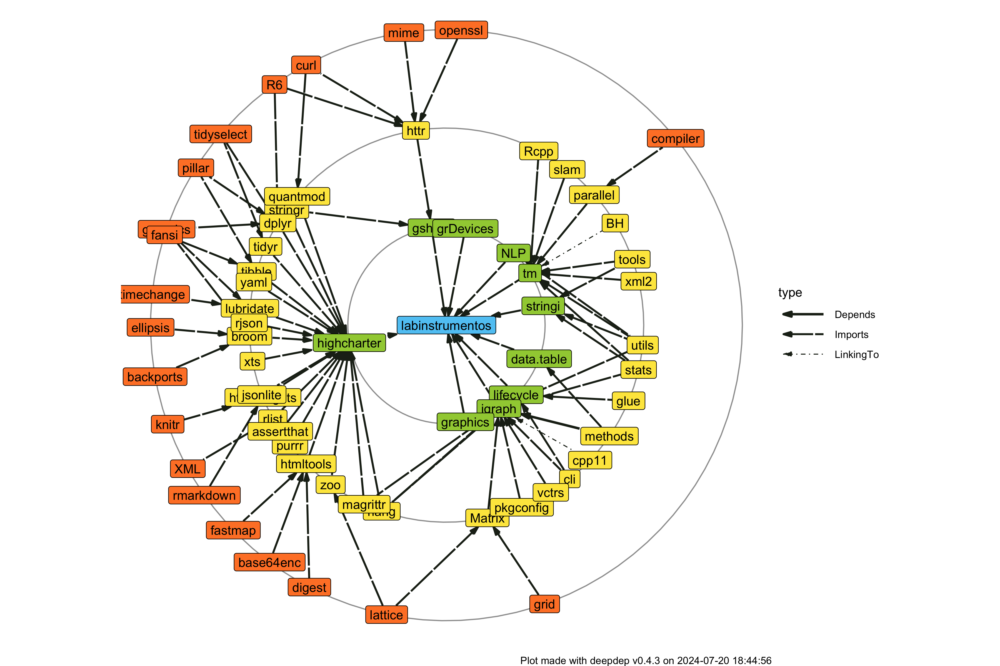

<!-- README.md is generated from README.Rmd. Please edit that file -->

# Datos y análisis del laboratorio de instrumentos

<!-- badges: start -->

[](https://lifecycle.r-lib.org/articles/stages.html#experimental)
[](https://CRAN.R-project.org/package=labinstrumentos)
[](https://github.com/SEREMICTCI/labinstrumentos/actions)
<!-- badges: end -->

Este es un paquete de <i class="fab fa-r-project"></i> que contiene los
datos procesados del laboratorio de intrumentos, así como herramientas
complementarias para su análisis y visualización.

## Sobre <i class="fab fa-r-project"></i>

`R` es un lenguaje de programación estadística de alto nivel usado para
el análisis de datos, así como para el desarrollo de herramientas
informáticas como sitios web, reportes, aplicaciones, libros digitales,
etc. Para más información puedes visitar el sitio de
[R-project](https://www.r-project.org/about.html).

## Instalación

Para instalar el paquete directamente a tu computadora, asegurate de
tener instalado `R`, luego escribe en tu consola de `R` lo siguiente:

``` r
# install.packages("devtools")
devtools::install_github("SEREMICTCI/labinstrumentos")
```

## Dependencias

Este paquete, así como sus correspondientes análisis, dependen de los
siguientes paquetes.



## Reconocimiento

Para citar este paquete en publicaciones puedes correr la siguiente
función en tu consola de `R`.

``` r
citation("labinstrumentos")
```

Lo que te dará el siguiente resultado.


    To cite package 'labinstrumentos' in publications use:

      Matías Castillo Aguilar and Carlos Morales Quiroz (2021).
      labinstrumentos: Datos del Laboratorio de Instrumentos. R package
      version 0.0.0.9011. https://github.com/SEREMICTCI/labinstrumentos

    A BibTeX entry for LaTeX users is

      @Manual{,
        title = {labinstrumentos: Datos del Laboratorio de Instrumentos},
        author = {Matías {Castillo Aguilar} and Carlos {Morales Quiroz}},
        year = {2021},
        note = {R package version 0.0.0.9011},
        url = {https://github.com/SEREMICTCI/labinstrumentos},
      }
